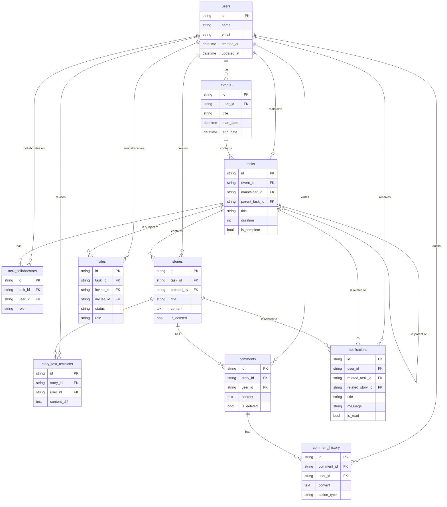

# Database Architecture

This document outlines the database schema for the SSE application. It includes details on each table and a diagram illustrating the relationships between them.

## Table Relationships

- **users**: The central table for user accounts.
- **events**: Represents high-level events or milestones. Each event is owned by a single **user**.
- **tasks**: The core unit of work.
  - Each task belongs to one **event**.
  - Each task has one **user** as a maintainer.
  - Tasks can be hierarchical, with a task having a `parent_task_id` that points to another task.
- **task_collaborators**: A many-to-many join table between **tasks** and **users**, defining which users are collaborators on which tasks and their role.
- **stories**: Represents a document or narrative associated with a **task**. Each story is created by a **user**.
- **story_text_revisions**: Stores the change history for a **story**, linking each revision to the **user** who made it.
- **comments**: Holds user comments on a **story**. Each comment is made by a **user**.
-
- **comment_history**: Stores the edit/deletion history of a **comment**, linking each history entry to the **user** who performed the action.
- **invites**: Manages invitations for **users** to collaborate on **tasks**. It tracks the inviter, the invitee, and the status of the invitation.
- **notifications**: Stores notifications for **users**. Notifications can be optionally linked to a `related_task_id` or `related_story_id`.

## Entity-Relationship Diagram

